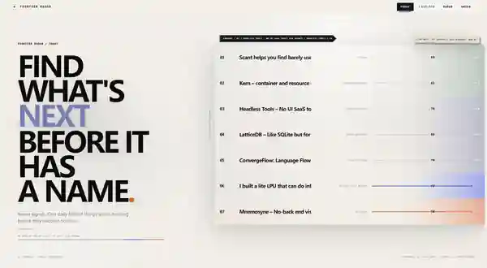
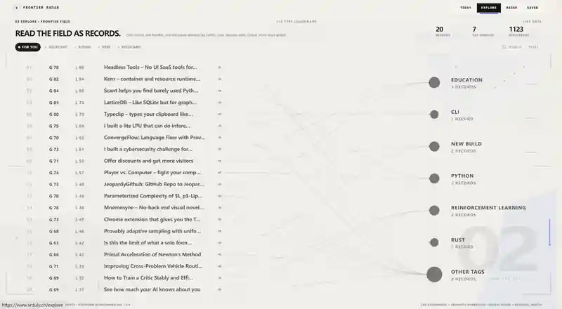
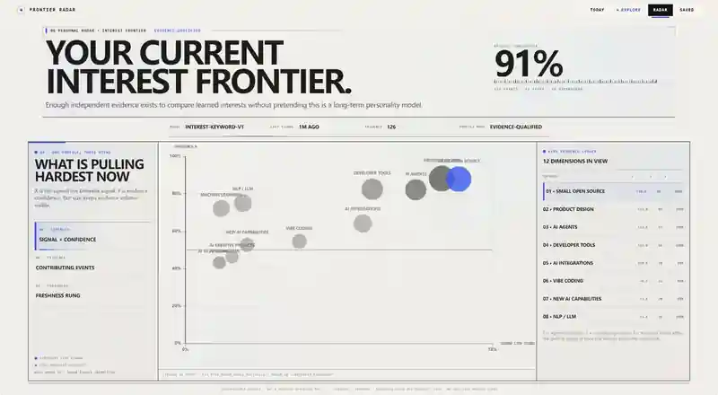

# Frontier Radar

> **Find what is becoming important before it becomes obvious.**
>
> Frontier Radar is a personalized frontier-intelligence product that discovers emerging technical signals, explains why they matter now, connects them into higher-level patterns, and turns them into research or product directions.

**Live product:** https://www.xrduly.cn  
**Today:** https://www.xrduly.cn/today



```text
Discover → Understand → Connect → Get Inspired → Build
```

## Why this exists

Technical discovery has a timing problem.

By the time a project reaches a trending page, a paper becomes widely discussed, or a new tool appears in every AI newsletter, the interesting part may already be obvious. Trying to stay early by manually watching GitHub, Hugging Face, arXiv, Hacker News, Product Hunt, and social feeds creates the opposite problem: too much noise, too little context, and no clear answer to **what is actually worth your attention**.

Frontier Radar was built around a narrower question:

> **What is starting to matter now — and why should I care?**

Instead of treating discovery as a feed-reading problem, Frontier Radar treats it as an intelligence workflow. It collects fresh evidence, measures momentum, analyzes the underlying signal, adapts to personal interests, looks for convergence across signals, and then pushes one step further: **what could this become, and what could be built from it?**

## What makes it different

| Typical discovery tool | Frontier Radar |
| --- | --- |
| Shows what is already popular | Looks for signals whose momentum is changing now |
| Optimizes for clicks, stars, or raw ranking | Combines recency, momentum, evidence, source context, and structured analysis |
| Gives you an infinite feed | Compresses the day into a bounded set of high-signal items |
| Summarizes each item independently | Connects multiple signals into shared patterns and directions |
| Treats everyone the same | Uses explicit and behavioral feedback to personalize what matters |
| Ends at “here is a project/paper” | Continues toward “why now?”, “why you?”, and “what could be built?” |

The goal is not to predict the future with certainty. The goal is to improve the quality and timing of attention.

## Product surfaces

### Today — a bounded daily frontier

A daily editorial selection of seven signals rather than an infinite feed.

- `01–05` — Core signals
- `06 Adjacent` — deliberately nearby but less obvious
- `07 Wildcard` — higher-variance exploratory direction

Each expanded signal exposes more than a title and score: the signal itself, timing, interpretation, personal relevance, and a possible build direction. The interface is intentionally closer to an instrument than a conventional analytics dashboard.

### Explore — read the frontier as a field

Explore widens the candidate pool while keeping ranking and source context visible. Lenses such as `FOR YOU`, `ADJACENT`, `RISING`, `NEW`, and `WILDCARD` change how the field is ranked without pretending that editorial position is a semantic coordinate.



The current Explore visualization uses a Type Colonnade / record-field grammar: one record, one hairline, one metadata-derived tag family. The goal is to make relationships inspectable without hiding the underlying records.

### Radar — personal direction, not just personal ranking

Radar turns interaction evidence into an inspectable interest frontier. It shows which technical directions are pulling hardest now, how much evidence contributes to that view, and how confident the current profile is.



The intent is not to claim a permanent personality model. The profile is evidence-qualified, changes with observed behavior, and keeps strength, evidence, and freshness visible as separate concepts.

### Signal Weave — from items to patterns

Seven daily signals are synthesized into higher-level relationships:

```text
7 signals → 3 higher-level patterns → Final Take
```

The purpose is to reveal convergence: repeated enabling technologies, shared constraints, and research/product directions that are easy to miss when every item is read in isolation.

### Project Intelligence — from discovery to decision

A deeper reading mode for selected projects and signals:

```text
01 CAPTURE
02 EVIDENCE
03 INTERROGATION
04 RESOLUTION
05 BUILD
```

The product keeps source traceability while moving from:

```text
What is this?
    ↓
Why does it matter now?
    ↓
What evidence supports it?
    ↓
What should I question?
    ↓
Is it worth pursuing?
    ↓
What could be built from it?
```

### Saved — research memory

A lightweight research shelf for keeping useful findings. The current v1 Saved state is browser-local and supports local backup/export behavior.

## Who it is for

Frontier Radar is designed for people who regularly ask questions like:

- **Researchers:** Which emerging projects, methods, or papers are worth investigating before they become mainstream?
- **Engineers:** Which tools or technical shifts are gaining enough momentum to justify a closer look?
- **Product builders:** Where are multiple technical signals converging into a possible product opportunity?
- **Technical generalists:** How can I follow fast-moving AI and software ecosystems without living inside five different feeds?

## How the product works

A simplified example:

```text
A new GitHub project begins accelerating
        ↓
Related evidence appears on Hugging Face / arXiv / Hacker News
        ↓
Frontier Radar normalizes the evidence and measures momentum
        ↓
AI analysis explains the project, its context, and WHY NOW
        ↓
Personalization estimates whether it is relevant to you
        ↓
Today selects it as one of a small number of daily signals
        ↓
Signal Weave connects it with other signals
        ↓
Project Intelligence turns the signal into evidence, questions, and build directions
```

This creates a loop that is closer to a lightweight research analyst than a conventional news reader.

## Product principles

1. **Early is more useful than merely popular.** Raw popularity is evidence, not the final objective.
2. **Evidence should stay attached to interpretation.** AI analysis must remain traceable to source material.
3. **A smaller daily set can be more useful than an infinite feed.** Attention is treated as a scarce resource.
4. **Personalization should be explicit and inspectable.** Feedback signals should improve relevance without hiding the underlying evidence.
5. **Discovery should lead somewhere.** A useful signal should become a question, a research direction, or a build direction.
6. **Interaction design is part of the intelligence system.** The UI is designed to slow down scanning at the right moments rather than optimize only for throughput.

## Data sources

The repository currently contains ingestion paths for:

- GitHub
- Hugging Face
- arXiv
- Hacker News
- Product Hunt

Collectors are designed around normalization, retries, rate-limit awareness, source traceability, and metric snapshots rather than simply copying source feeds into the UI.

## System architecture

```text
External sources
    ↓
Collectors
    ↓
Raw source records
    ↓
Normalization / deduplication
    ↓
Metric snapshots + momentum history
    ↓
Frontier scoring
    ↓
Structured AI analysis / synthesis
    ↓
Feed + project materialization
    ↓
Personalization layer
    ↓
Next.js product surfaces
```

Key repository areas:

```text
src/app/                  Product routes and visual surfaces
src/components/frontier/  Frontier-specific interaction components
src/lib/collectors/       Source collectors and normalization
src/lib/scoring/          Frontier / momentum scoring
src/lib/ai/               Provider abstraction, analysis and synthesis
src/lib/feed/             Feed, discovery and project materialization
src/lib/personalization/  Feedback, profiles and ranking logic
src/lib/supabase/         Database clients and boundaries
supabase/migrations/      Database schema and security migrations
scripts/                  Collector, diagnostics and analysis utilities
e2e/                      Browser integration checks
```

## Technology

- Next.js 16
- React 19
- TypeScript
- Tailwind CSS + custom CSS interaction systems
- Supabase / PostgreSQL
- Vercel
- OpenAI-compatible AI provider abstraction
- GitHub Actions

The AI layer is provider-abstracted; application code is not intended to depend directly on one model vendor.

## Visualization attribution

Selected visualization and interaction patterns in Explore and Personal Radar were developed with reference to the **Lieflat Charts** chart and interaction system.

- Upstream: https://github.com/larashero3-dotcom/lieflat-charts
- Lieflat Charts license: **PolyForm Noncommercial License 1.0.0**
- Full notice: [THIRD_PARTY_NOTICES.md](THIRD_PARTY_NOTICES.md)

Frontier Radar's own source-visible status does not replace third-party license obligations for any Lieflat-derived material.

## Local development

Requirements:

- Node.js 22+
- npm

Clone and install:

```bash
git clone https://github.com/barbaralazarev08182-lab/frontier-radar.git
cd frontier-radar
npm ci
cp .env.example .env.local
```

For UI development without a production database, use fixture mode:

```bash
FRONTIER_DATA_MODE=fixture npm run dev
```

Then open:

```text
http://localhost:3000
```

The `.env.example` file documents optional server-side integrations. Do not place real credentials in committed files.

## Verification

Before opening a pull request:

```bash
npm run typecheck
npm run lint
npm run test
npm run build
```

CI runs the same core verification path without production credentials or external writes, including a production dependency security audit.

## Security model

The repository is designed around explicit boundaries:

- secrets remain server-side and are loaded from environment variables;
- non-production Vercel environments are prevented from persisting production runtime writes;
- public application reads are separated from privileged database access;
- cron endpoints require server-side authorization;
- `.env`, `.env.local`, `.env.*.local`, `.vercel`, PEM files, logs, and local data outputs are ignored by Git.

See [SECURITY.md](SECURITY.md) for vulnerability reporting and credential-handling guidance.

## Contributing

See [CONTRIBUTING.md](CONTRIBUTING.md).

This project intentionally treats interaction design, information architecture, ranking logic, and data integrity as parts of the same product system. For UI changes, visual evidence matters in addition to a successful build.

## Project status

Frontier Radar is an actively developed research/product experiment. Some historical documents under `docs/` record earlier product states and should be read as development history rather than current setup instructions.

For the current contributor orientation, start with [docs/START-HERE.md](docs/START-HERE.md).

## Source visibility and reuse

This repository is public for product transparency, technical learning, and portfolio/research visibility. It is **source-visible, not currently released under an open-source license**.

No additional rights to copy, modify, redistribute, or commercially reuse the code are granted beyond those provided by applicable law unless a `LICENSE` file is added later.
